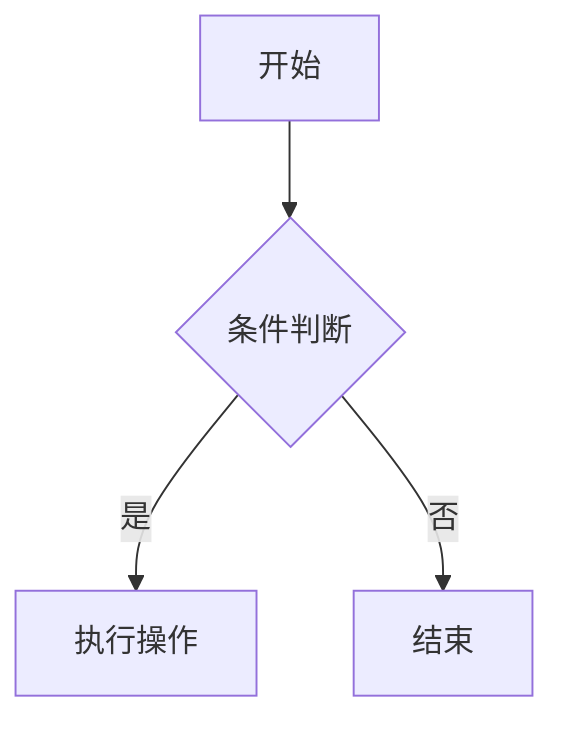

## 什么是 Markdown？

Markdown 是一种轻量级标记语言，让你可以用纯文本格式编写文档，然后转换为 HTML 或其他格式。它是写博客、记笔记的最佳选择。

## 基础语法

### 标题

```markdown
# 一级标题
## 二级标题
### 三级标题
#### 四级标题
##### 五级标题
###### 六级标题
```

### 文本格式

```markdown
**粗体文本**
*斜体文本*
~~删除线文本~~
`行内代码`
```

### 列表

```markdown
无序列表：
- 项目 1
- 项目 2
  - 子项目

有序列表：
1. 第一步
2. 第二步
3. 第三步

任务列表：
- [x] 已完成
- [ ] 待完成
```

### 链接和图片

```markdown
[链接文字](https://example.com)
[带标题的链接](https://example.com "标题")


```

### 引用

```markdown
> 这是一段引用文字。
> 
> 可以有多行。
```

### 代码块

````markdown
```python
def hello():
    print("Hello!")
```
````

### 表格

```markdown
| 左对齐 | 居中对齐 | 右对齐 |
|:-------|:-------:|-------:|
| 左 | 中 | 右 |
```

### 分割线

```markdown
---
***
___
```

## 高级用法

### 脚注

```markdown
这里有一个脚注[^1]。

[^1]: 这是脚注内容。
```

### 数学公式

```markdown
行内公式：$E = mc^2$

块级公式：
$$
\sum_{i=1}^{n} x_i = x_1 + x_2 + ... + x_n
$$
```

### Mermaid 图表

````markdown

````

## 写作建议

1. **简洁明了** — 避免冗长的句子
2. **结构清晰** — 善用标题层级
3. **代码示例** — 技术文章多用代码说明
4. **图表辅助** — 复杂概念用图表解释

---

> Markdown 是写作者的好朋友，掌握它能让你的写作效率倍增！
