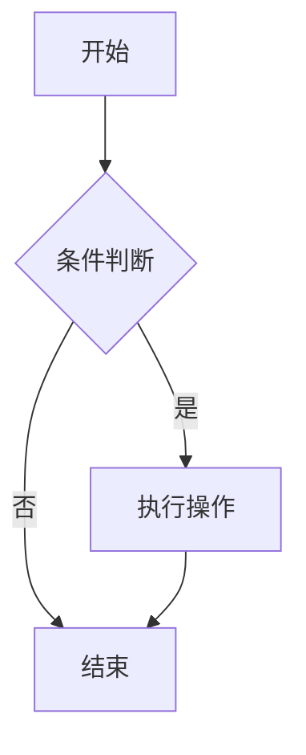
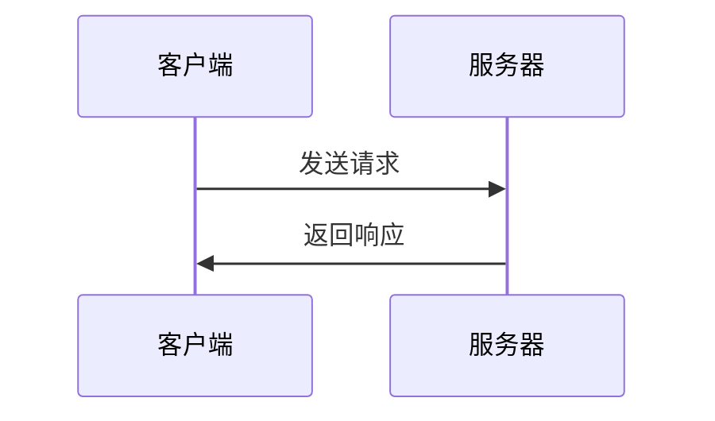
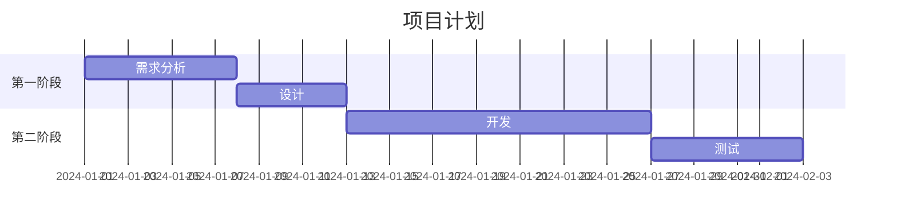

# 技术博客 Markdown 写作指南

## 1. 文字格式

| 语法 | 效果 | 说明 |
|------|------|------|
| `**粗体**` | **粗体** | 强调重点 |
| `*斜体*` | *斜体* | 术语或引用 |
| `~~删除线~~` | ~~删除线~~ | 废弃内容 |
| `` `行内代码` `` | `行内代码` | 变量、函数名 |
| `> 引用` | 引用块 | 重要说明 |

## 2. 代码高亮

### 单行代码

使用 `print()` 函数输出

### 代码块（指定语言）

````markdown
```python
def fibonacci(n):
    if n <= 1:
        return n
    return fibonacci(n-1) + fibonacci(n-2)

print(fibonacci(10))
```
````

效果：

```python
def fibonacci(n):
    if n <= 1:
        return n
    return fibonacci(n-1) + fibonacci(n-2)

print(fibonacci(10))
```

### 常用语言标识

| 语言 | 标识 |
|------|------|
| Python | `python` 或 `py` |
| JavaScript | `javascript` 或 `js` |
| TypeScript | `typescript` 或 `ts` |
| Java | `java` |
| C/C++ | `c` 或 `cpp` |
| Go | `go` |
| Rust | `rust` |
| Bash/Shell | `bash` 或 `sh` |
| SQL | `sql` |
| HTML | `html` |
| CSS | `css` |
| JSON | `json` |
| YAML | `yaml` |
| Markdown | `markdown` 或 `md` |
| Dockerfile | `dockerfile` |

## 3. 表格

```markdown
| 左对齐 | 居中对齐 | 右对齐 |
|:-------|:-------:|-------:|
| 内容1  |  内容2  |  内容3 |
| 内容4  |  内容5  |  内容6 |
```

效果：

| 左对齐 | 居中对齐 | 右对齐 |
|:-------|:-------:|-------:|
| 内容1  |  内容2  |  内容3 |
| 内容4  |  内容5  |  内容6 |

## 4. 图片

```markdown


```

居中图片：

```html
<div align="center">
  
  <p>图片标题</p>
</div>
```

## 5. 链接

```markdown
[链接文字](https://example.com)
[带标题的链接](https://example.com "鼠标悬停显示")
```

## 6. 数学公式

行内公式：`$E = mc^2$`

块级公式：

```markdown
$$
\sum_{i=1}^{n} x_i = x_1 + x_2 + ... + x_n
$$
```

常用公式：

```markdown
# 二次方程求根公式
$$x = \frac{-b \pm \sqrt{b^2-4ac}}{2a}$$

# 积分
$$\int_0^\infty e^{-x^2} dx = \frac{\sqrt{\pi}}{2}$$

# 矩阵
$$\begin{pmatrix} a & b \\ c & d \end{pmatrix}$$
```

## 7. Mermaid 图表

### 流程图

````markdown

````

### 时序图

````markdown

````

### 甘特图

````markdown

````

## 8. 任务列表

```markdown
- [x] 已完成的任务
- [ ] 待完成的任务
```

## 9. 折叠内容

```html
<details>
<summary>点击展开</summary>

这里是隐藏的内容。

```python
print("被折叠的代码")
```

</details>
```

## 10. 键盘按键

```html
<kbd>Ctrl</kbd> + <kbd>C</kbd> 复制
```

## 11. 技术博客文章模板

```markdown
---
title: "文章标题"
date: 2026-06-21
tags: ["标签1", "标签2"]
categories: ["分类"]
summary: "文章摘要"
ShowToc: true
TocOpen: true
---

## 背景

介绍问题的背景。

## 解决方案

### 方案一：方法A

```python
def solution():
    pass
```

### 方案二：方法B

```bash
git commit -m "fix: 问题描述"
```

## 实现步骤

1. 第一步：xxx
2. 第二步：xxx
3. 第三步：xxx

## 效果展示

| 指标 | 优化前 | 优化后 |
|------|--------|--------|
| 耗时 | 10s | 1s |
| 内存 | 500MB | 100MB |

## 总结

- 关键点1
- 关键点2

## 参考资料

- [链接1](https://example.com)
```

---

> 本文档保存在 `E:\bk\blog\docs\markdown-guide.md`
