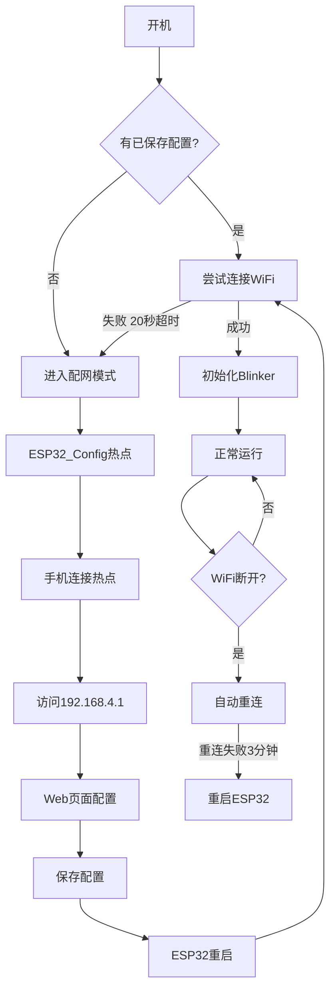

---
title: "ESP32 Web 配网实战"
publishDate: 2026-06-25 00:00:00
description: "通过 Web 页面为 ESP32 配置 WiFi 和 Blinker 授权码，支持历史配置记录，开机自动重连"
tags: ["ESP32", "Blinker", "WiFi配网"]
categories: ["嵌入式开发"]
language: '中文'
draft: false
comment: true
---

## 前言

在上一篇 [Blinker 开发入门指南](/post/blinker-getting-started/) 中，我们了解了 Blinker 的基础用法。但在实际项目中，WiFi 名称和密码写死在代码里非常不方便——每换一个网络就要重新烧录。

本文介绍一个 ESP32 Web 配网方案，通过手机连接 ESP32 热点，在网页上配置 WiFi 和 Blinker 授权码，配置保存后开机自动重连。

## 功能特性

- 开机自动连接已保存的 WiFi
- 连接失败时自动进入配网模式（AP 热点 + Web 服务器）
- Web 页面支持 WiFi 扫描选择、密码输入、Blinker 授权码填写
- 历史配置记录（最多3条），点击快速填充
- GPIO0 长按3秒清除配置并重启
- LED 指示灯状态：常亮=已连接，闪烁=配网中，熄灭=断开

## 项目结构

```
ESP32_Blinker_NET/
├── src/
│   ├── main.cpp          # 主程序：Blinker 初始化 + WiFi 管理
│   └── WIFIConnect.cpp   # WiFi 配网模块实现
├── include/
│   └── WIFIConnect.h     # WiFi 配网模块头文件
├── lib/
│   └── blinker-library-master/  # 本地 Blinker 库
└── platformio.ini        # PlatformIO 配置
```

## 工作流程



## 核心代码解析

### 主程序 main.cpp

主程序非常简洁，核心逻辑就三步：

```cpp
#define BLINKER_PRINT Serial
#define BLINKER_WIFI

#include <Blinker.h>
#include "WIFIConnect.h"

WIFIConnect wifiManager("ESP32_Config");

void setup() {
    Serial.begin(115200);
    wifiManager.begin();

    if (wifiManager.isConnected()) {
        Blinker.begin(
            wifiManager.getAuth().c_str(),
            wifiManager.getSSID().c_str(),
            ""
        );
        Blinker.attachData(dataRead);
    }
}

void loop() {
    wifiManager.loop();
    if (wifiManager.isConnected()) {
        Blinker.run();
    }
}
```

关键点：

- `wifiManager.begin()` 内部处理了所有 WiFi 连接逻辑
- `Blinker.begin()` 的密码参数传空字符串，因为 WiFi 已经通过 `WiFi.begin()` 连接
- `loop()` 中先处理 WiFi 状态，再运行 Blinker

### WIFIConnect 类

这是配网的核心模块，封装了 AP 热点、Web 服务器、DNS 重定向、EEPROM 存储等功能。

**初始化流程：**

```cpp
void WIFIConnect::begin() {
    pinMode(_ledPin, OUTPUT);
    pinMode(_resetPin, INPUT_PULLUP);

    if (restoreConfig()) {
        // 有保存的配置 → 尝试连接
        WiFi.begin(savedSSID, savedPassword);
        // 等待20秒...
        if (WiFi.status() == WL_CONNECTED) {
            // 连接成功
        } else {
            setupMode();  // 进入配网模式
        }
    } else {
        setupMode();  // 无配置，直接配网
    }
}
```

**配网模式启动：**

```cpp
void WIFIConnect::setupMode() {
    WiFi.mode(WIFI_AP);
    WiFi.softAP(_apName);  // 创建热点 "ESP32_Config"
    dnsServer.start(53, "*", IPAddress(192, 168, 4, 1));  // DNS重定向
    server.on("/", HTTP_GET, handleRootCallback);
    server.on("/save", HTTP_POST, handleSaveCallback);
    server.begin();
    scanWiFi();  // 扫描可用WiFi
}
```

**配置保存：**

```cpp
void WIFIConnect::handleSave() {
    String ssid = server.arg("ssid");
    String password = server.arg("password");
    String auth = server.arg("auth");

    preferences.putString("ssid", ssid);
    preferences.putString("password", password);
    preferences.putString("auth", auth);
    saveWiFiHistory(ssid, password, auth);

    delay(1000);
    ESP.restart();  // 保存后重启
}
```

### Web 配网页面

配网页面包含：

- WiFi 网络下拉选择（自动扫描）
- WiFi 密码输入（支持显示/隐藏切换）
- Blinker 授权码输入
- 历史配置列表（点击快速填充）
- 保存并连接按钮

页面使用渐变背景和圆角卡片设计，手机端体验友好。

### WiFi 掉线检测

```cpp
void WIFIConnect::loop() {
    // 每5秒检查WiFi状态
    if (millis() - lastWifiCheck > 5000) {
        if (WiFi.status() != WL_CONNECTED && !_isSettingMode) {
            WiFi.begin(savedSSID, savedPassword);  // 尝试重连
        }
        lastWifiCheck = millis();
    }

    // 长按GPIO0超过3秒 → 清除配置重启
    if (digitalRead(_resetPin) == LOW) {
        if (millis() - _buttonPressStartTime > 3000) {
            reset();
        }
    }
}
```

## 硬件连接

| 引脚 | 功能 | 说明 |
|------|------|------|
| GPIO2 | LED 指示灯 | 连接=常亮，配网=闪烁，断开=熄灭 |
| GPIO0 | 重置按键 | 长按3秒清除配置并重启 |

## 使用步骤

1. 烧录固件到 ESP32
2. 手机连接热点 `ESP32_Config`
3. 浏览器访问 `192.168.4.1`
4. 选择 WiFi、输入密码和 Blinker 授权码
5. 点击保存，ESP32 自动重启并连接

## 总结

这个 Web 配网方案解决了 Blinker 项目中 WiFi 配置固化的问题，通过 Web 页面和历史记录功能，让用户无需重新烧录即可切换网络。配合 Blinker 的心跳包和回调机制，可以快速搭建物联网应用。

> 本项目完整代码见 `E:\Embedded\库\Blinker开发规范\ESP32_Blinker_NET`
