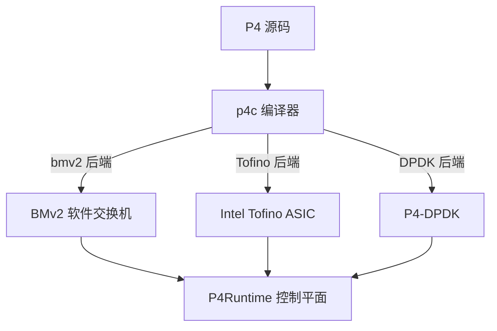
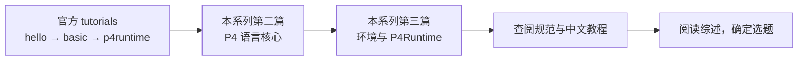

本文面向已了解 SDN 基本概念、准备学习 P4 的读者，介绍三部分内容：P4 解决的问题、整体架构、推荐的学习路径。语言与实验细节见系列第二、三篇。

---

## 一、传统网络设备的局限

传统交换机和路由器的转发逻辑在出厂时由固件固定：能解析哪些协议、匹配哪些字段、执行哪些动作，均为预定义。验证新协议只能等待厂商更新固件或自行设计硬件，对研究者而言都不现实。这一困境在 2008 年的 OpenFlow 论文中被明确提出 [2]。

---

## 二、OpenFlow：控制面可编程，数据面仍然固定

OpenFlow 将控制逻辑从转发设备中抽出，集中到控制器，通过流表（匹配字段 + 动作）指导交换机转发 [2]。控制器因此可以编程，但流表的匹配字段集合由规范预定义（MAC、IP、端口等），数据面本身不可修改：无法解析自定义协议，也无法改变处理流水线。

这是 P4 相关综述反复强调的论点：OpenFlow 并未完全实现 SDN 愿景，数据面可编程是下一代 SDN 的关键 [3]。

---

## 三、P4：数据面可编程

P4（Programming Protocol-independent Packet Processors）由 Bosshart 等人于 2014 年在 SIGCOMM 提出 [1]，目标是把数据面的处理逻辑定义为可编译、可部署、可重新配置的程序。其三个设计目标：

| 目标 | 含义 |
|------|------|
| 可重配置 | 转发逻辑可通过重新编译部署修改，无需更换硬件 |
| 协议无关 | 匹配与处理的字段由用户定义，不受厂商限制 |
| 目标无关 | 同一份程序可编译到软件交换机、ASIC、FPGA 等目标 |

P4 将可编程交换机抽象为 PISA（Protocol-independent Switch Architecture）流水线 [3][4]：

PISA 三段分别对应解析输入、查表处理、序列化输出。语言设计保证每个报文的处理操作次数有界，因此性能可预期 [4]。

---

## 四、与 OpenFlow 的区别

| 对比项 | OpenFlow | P4 |
|--------|----------|-----|
| 可编程范围 | 仅控制面 | 控制面 + 数据面 |
| 匹配字段 | 预定义（MAC、IP 等） | 用户自定义 |
| 协议支持 | 固定协议集合 | 任意协议，可现场重配置 |
| 运行平台 | 支持 OpenFlow 的交换机 | BMv2 / Tofino / FPGA |
| 南向接口 | OpenFlow 协议 | P4Runtime（gRPC） |

简言之：OpenFlow 使控制面可编程，P4 使整个数据面可编程。

---

## 五、生态与运行平台

学习阶段不需要专用硬件。常用组合为 p4c 编译器、BMv2 软件交换机、Mininet 拓扑仿真与 P4Runtime 控制平面，均可运行于普通计算机 [5][6][7]。

---

## 六、学习路径

建议以官方练习为主线，规范与中文资料为辅：

1. 完成官方 tutorials 的 hello 与 basic 练习 [6]；
2. 语法细节查阅 P4-16 规范 [4]；
3. 需要中文参考时查阅张恒华《P4 中文教程》[8]；
4. 确定研究方向前阅读相关综述（如 ACM Computing Surveys 2023 [3]）。

---

## 参考文献

1. P. Bosshart, D. Daly, G. Gibb, et al. *P4: Programming Protocol-Independent Packet Processors*. ACM SIGCOMM 2014. https://doi.org/10.1145/2740070.2626294
2. N. McKeown, T. Anderson, H. Balakrishnan, et al. *OpenFlow: Enabling Innovation in Campus Networks*. ACM SIGCOMM CCR 2008. https://doi.org/10.1145/1355734.1355746
3. A. Liatifis, P. Sarigiannidis, V. Argyriou, T. Lagkas. *Advancing SDN from OpenFlow to P4: A Survey*. ACM Computing Surveys, 2023. https://doi.org/10.1145/3556973
4. P4 Language Consortium. *P4-16 Language Specification v1.2.5*. https://p4.org/p4-specs/
5. P4.org. *P4 官网*. https://p4.org/
6. p4lang. *P4 Tutorials*. https://github.com/p4lang/tutorials
7. p4lang. *behavioral-model（BMv2）*. https://github.com/p4lang/behavioral-model
8. 张恒华. *P4 中文教程*. https://github.com/zhh2001/p4-language-guide-zh
9. 左青云 等. *基于 OpenFlow 的 SDN 技术研究*. 计算机应用研究, 2013.

---

*本文是「P4 快速入门」系列的第 1 篇。*

*系列导航：下一篇 → [一次看懂 P4 程序](/blog/p4/p4-02-language-core)*
