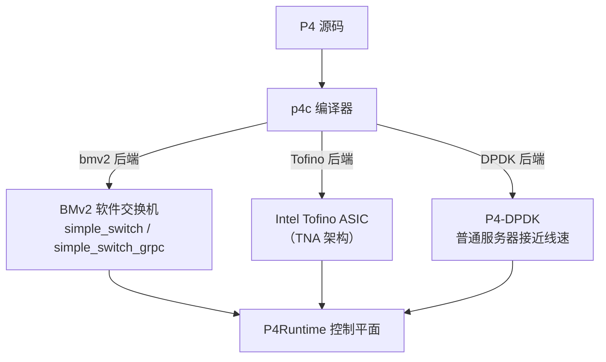

import { Aside } from 'astro-pure/user'

这篇文章不是语法手册。假设你已经知道 SDN 是什么，或者至少听说过"控制面与数据面分离"。本文只回答三个问题：**P4 到底解决了什么问题、它长什么样、以及接下来该怎么学**。语法细节和动手实验放在系列第二、三篇，这里先把地图画出来。

---

## 一、网络设备的"黑盒"困境

在传统网络里，交换机和路由器是一个"黑盒"：**协议是固化的、功能是厂商决定的、创新是等硬件更新的**。一台交换机出厂时支持 IPv4、IPv6、MPLS 这些预定义协议，如果你想验证一个新协议（比如一个自定义的拥塞控制头），要么等厂商发新版固件，要么自己造硬件——对绝大多数研究者和工程师来说，这两条路都走不通。

这个问题在 2008 年的 OpenFlow 论文里被正式提出：研究者需要一个**可以在真实网络上做实验的平台**，而不是只能在模拟器里自娱自乐 [2]。

---

## 二、SDN 与 OpenFlow：只解决了一半问题

SDN 的核心思想是**把控制逻辑从转发设备里抽出来，集中到一个逻辑控制器**。OpenFlow 是这条路上最成功的协议：它规定了控制器和交换机之间怎么通信、流表长什么样（匹配字段 + 动作），让"写自己的控制器"成为可能 [2]。

但 OpenFlow 有一个根本限制：**它只开放了控制面，数据面仍然是固定的**。交换机只能匹配 OpenFlow 协议里预先定义好的那组字段（MAC、IP、端口……），无法解析你自定义的协议头，也无法改变转发流水线本身。

| OpenFlow 能做什么 | OpenFlow 不能做什么 |
|------------------|---------------------|
| 根据 MAC / IP / 端口等预定义字段转发 | 解析自定义或私有协议 |
| 控制器动态下发流表 | 修改数据面的处理流水线 |
| 集中式网络管理 | 让数据面理解新协议 |

换句话说：**OpenFlow 让你能写控制器，但交换机本身依然是厂商说了算的黑盒。** 这也是 2023 年那篇 P4 综述里反复强调的观点——SDN 的愿景"从未被 OpenFlow 真正实现"，数据面可编程才是下一代 SDN 的核心 [3]。

---

## 三、P4：让数据面也成为软件

P4（Programming Protocol-independent Packet Processors）于 2014 年由 Nick McKeown 团队在 SIGCOMM 上提出 [1]，目标是把"数据面如何转发"这件事也变成一段可以编译、部署、重配置的程序。

### P4 的三大设计目标

| 目标 | 含义 |
|------|------|
| **可重配置（Reconfigurability）** | 转发逻辑可以在现场重新配置，不用换硬件 |
| **协议无关（Protocol Independence）** | 匹配和处理哪些字段由你定义，不受厂商限制 |
| **目标无关（Target Independence）** | 同一份 P4 代码可以编译到不同目标（软件交换机、ASIC、FPGA） |

### PISA 架构：P4 眼中的交换机

P4 把任何可编程交换机抽象成一条固定的流水线——**解析（Parser）→ 匹配-动作（Match-Action）→ 反解析（Deparser）**，这就是常说的 PISA（Protocol-independent Switch Architecture）[3][4]。

和你写程序类比：Parser 类似"把输入解析成数据结构"，Match-Action 类似"查表 + 分支处理"，Deparser 类似"序列化输出"。整条流水线对每个报文执行的操作次数是**有界的**，这是 P4 语言设计上保证的性能下限 [4]。

---

## 四、P4 vs OpenFlow：本质区别

| 对比项 | OpenFlow | P4 |
|--------|----------|-----|
| 可编程范围 | 仅控制面 | 控制面 + 数据面 |
| 匹配字段 | 预定义（MAC、IP 等） | 用户自定义任意字段 |
| 协议支持 | 固定协议集合 | 任意协议，可现场重配置 |
| 运行平台 | 支持 OpenFlow 的交换机 | BMv2（软件）/ Tofino（硬件）/ FPGA |
| 南向接口 | OpenFlow 协议 | P4Runtime（gRPC） |

<Aside type='tip' title='核心理解'>

**OpenFlow 让你能写控制器，P4 让你能写交换机本身。** 这是两者最本质的区别——也是 P4 被称为"下一代 SDN"的原因。

</Aside>

---

## 五、P4 生态：它跑在哪里

当前生态里最常见的组合是：**p4c（编译器）→ BMv2（软件交换机）→ Mininet（拓扑仿真）→ P4Runtime（控制平面）**。对学习来说，全部可以在普通笔记本上跑起来，不需要任何特殊硬件 [5][6][7]。如果之后要做性能相关的实验，再考虑 P4-DPDK 或 Tofino 硬件。

---

## 六、为什么值得学，以及怎么学

### 为什么值得学

1. **快速验证想法**：想设计一个新协议或新转发逻辑？用 P4 写出来，在 BMv2 上几分钟就能跑通。
2. **论文生态成熟**：顶会里大量创新方案基于 P4 实现，P4 本身也是热门综述的主题 [3]。
3. **工具链完善**：官方提供教程、练习和 Docker/VM 环境，入门门槛比想象中低 [5][6]。
4. **与 ML/安全结合空间大**：数据平面线速检测、特征提取、遥测，都是当前活跃的研究方向（见第三篇）。

### 怎么学（避免重复造轮子）

我的建议很直接：**不要从零抄一遍教程，直接跑官方例子，再带着问题读规范**。下面是这条路线图：

国内有一份质量很高的中文教程（张恒华，《P4 中文教程》），覆盖规范 + V1Model + P4Runtime，**当词典和进阶读物用，不建议逐章复读** [8]。遇到具体语法问题，直接查 P4-16 规范原文，权威且准确 [4]。

---

## 参考文献

1. P. Bosshart, D. Daly, G. Gibb, et al. *P4: Programming Protocol-Independent Packet Processors*. ACM SIGCOMM 2014. https://doi.org/10.1145/2740070.2626294
2. N. McKeown, T. Anderson, H. Balakrishnan, et al. *OpenFlow: Enabling Innovation in Campus Networks*. ACM SIGCOMM CCR 2008. https://doi.org/10.1145/1355734.1355746
3. A. Liatifis, P. Sarigiannidis, V. Argyriou, T. Lagkas. *Advancing SDN from OpenFlow to P4: A Survey*. ACM Computing Surveys, 2023. https://doi.org/10.1145/3556973
4. P4 Language Consortium. *P4-16 Language Specification v1.2.5*. https://p4.org/p4-specs/
5. P4.org. *P4 官网*. https://p4.org/
6. p4lang. *P4 Tutorials（官方练习）*. https://github.com/p4lang/tutorials
7. p4lang. *behavioral-model（BMv2）*. https://github.com/p4lang/behavioral-model
8. 张恒华. *P4 中文教程*. https://github.com/zhh2001/p4-language-guide-zh
9. 左青云 等. *基于 OpenFlow 的 SDN 技术研究*. 计算机应用研究, 2013.

---

*本文是「P4 快速入门」系列的第 1 篇。*

*系列导航：下一篇 → [一次看懂 P4 程序](/blog/p4/p4-02-language-core)*
