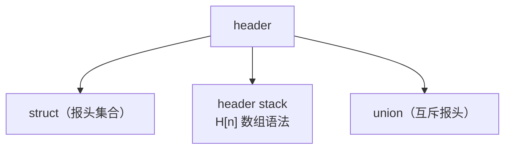
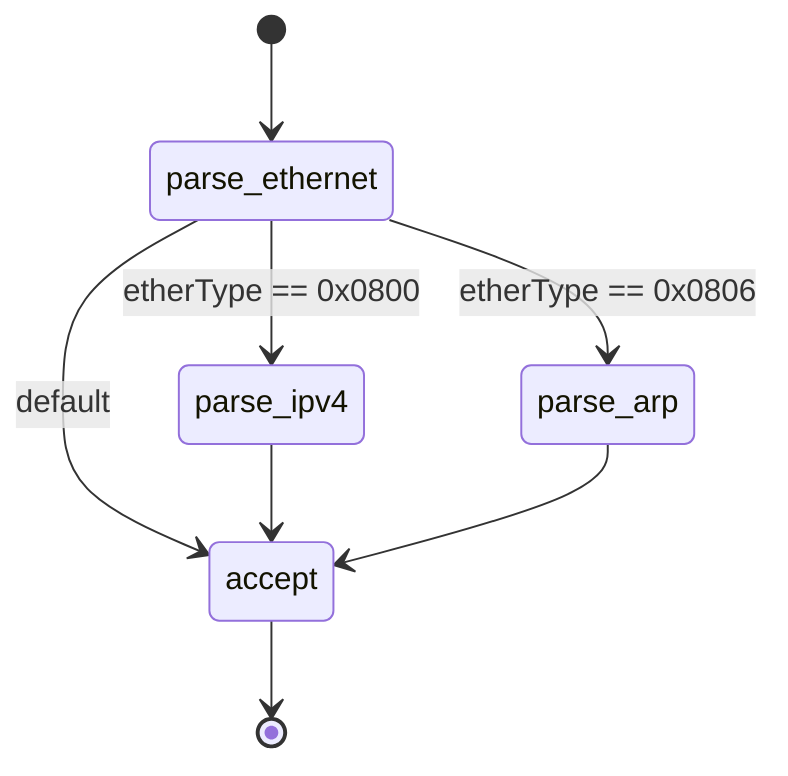
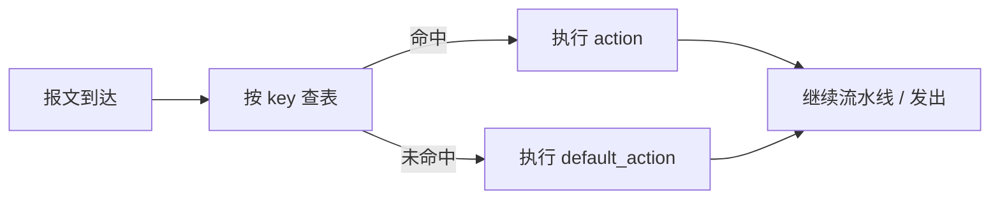
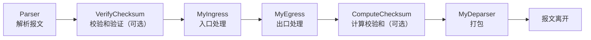

本文通过一个最小可运行示例讲解 P4 程序的核心构件：header、parser、match-action 表、control 与 deparser，最后介绍 V1Model 流水线与编译运行方法。语法细节对应规范章节 [1]。

---

## 一、最小可运行示例

以下程序实现以太网二层转发，可直接用 p4c 编译（环境搭建见第三篇）：

```p4
#include <core.p4>
#include <v1model.p4>

/* 1. 报头定义 */
header ethernet_t {
    bit<48> dstAddr;
    bit<48> srcAddr;
    bit<16> etherType;
}

header ipv4_t {
    bit<4>  version;
    bit<4>  ihl;
    bit<8>  diffserv;
    bit<16> totalLen;
    bit<16> identification;
    bit<3>  flags;
    bit<13> fragOffset;
    bit<8>  ttl;
    bit<8>  protocol;
    bit<16> hdrChecksum;
    bit<32> srcAddr;
    bit<32> dstAddr;
}

struct headers {
    ethernet_t ethernet;
    ipv4_t     ipv4;
}
struct metadata { }

/* 2. Parser：字节流解析为报头 */
parser MyParser(packet_in pkt, out headers hdr,
                inout metadata meta, inout standard_metadata_t standard_metadata) {
    state start {
        transition parse_ethernet;
    }
    state parse_ethernet {
        pkt.extract(hdr.ethernet);
        transition select(hdr.ethernet.etherType) {
            0x0800: parse_ipv4;
            default: accept;
        }
    }
    state parse_ipv4 {
        pkt.extract(hdr.ipv4);
        transition accept;
    }
}

/* 3. 入口处理：查表转发 */
control MyIngress(inout headers hdr, inout metadata meta,
                  inout standard_metadata_t standard_metadata) {
    action drop() {
        mark_to_drop(standard_metadata);
    }
    action forward(bit<9> egress_port) {
        standard_metadata.egress_spec = egress_port;
    }
    table l2_forward {
        key = { hdr.ethernet.dstAddr: exact; }
        actions = { forward; drop; }
        default_action = drop();
        size = 1024;
    }
    apply {
        l2_forward.apply();
    }
}

/* 4. 出口处理与校验和（此处留空） */
control MyEgress(inout headers hdr, inout metadata meta,
                 inout standard_metadata_t standard_metadata) {
    apply { }
}
control VerifyChecksum(inout headers hdr, inout metadata meta) {
    apply { }
}
control ComputeChecksum(inout headers hdr, inout metadata meta) {
    apply { }
}

/* 5. Deparser：报头重新打包 */
control MyDeparser(packet_out pkt, in headers hdr) {
    apply {
        pkt.emit(hdr.ethernet);
        pkt.emit(hdr.ipv4);
    }
}

/* 6. 按 V1Model 顺序组装 */
V1Switch(MyParser(), VerifyChecksum(), MyIngress(),
         MyEgress(), ComputeChecksum(), MyDeparser()) main;
```

程序流程：解析以太网头，IPv4 报文继续解析，查表决定转发端口或丢弃，重新打包发出。

---

## 二、核心构件

### Header：报头定义

`header` 描述协议头布局，字段为定宽整数 `bit<W>`。相关概念（规范 §7）[1]：

- `struct`：组合多个报头；
- header stack：表示重复报头（如 VLAN 标签栈）。P4-16 使用数组语法 `vlan_tag[2]`，P4-14 的 `header_stack<...>` 已废弃（规范 §7.2.3）；
- `union`：表示互斥报头（IPv4 / IPv6 二选一）；
- `isValid()`：仅被 `extract` 过的报头有效。



### Parser：报文解析状态机

parser 为有限状态机：每个状态 `extract` 提取字节，`select` 按字段值选择后续状态（规范 §13）[1]。



常用原语：

```p4
pkt.extract(hdr.ethernet);                    // 提取以太网头
transition select(hdr.ethernet.etherType) {   // 按 etherType 跳转
    0x0800: parse_ipv4;
    default: accept;
}
verify(hdr.ipv4.version == 4, error.Ipv4IncorrectVersion);  // 校验失败进入 reject
bit<16> t = lookahead(bit<16>);               // 预览但不消费字节
```

### Match-Action：匹配-动作表

`table` 声明匹配字段（key）与可选动作（actions），命中后执行对应 action。三种匹配类型：

| 匹配类型  | 语义           | 典型用途        |
| --------- | -------------- | --------------- |
| `exact`   | 全比特精确匹配 | MAC 表、VLAN 表 |
| `lpm`     | 最长前缀匹配   | IP 路由表       |
| `ternary` | 值 + 掩码      | ACL、流量分类   |



数据面状态通过 `counter` / `meter` / `register` 维护。注意 v1model 中表属性 `counters` 仅可绑定 `direct_counter`；普通 `counter` 需在 action 中显式调用 `count(index)` [2]。

```p4
// direct_counter：绑定到表，命中表项自动计数
direct_counter(CounterType.PACKETS_AND_BYTES) port_counter;
table l2_forward {
    key = { hdr.ethernet.dstAddr: exact; }
    actions = { forward; drop; }
    counters = port_counter;
}

// 普通 counter：在 action 中显式计数
counter<bit<64>, bit<32>>(1024, CounterType.PACKETS_AND_BYTES) flow_counter;
action count_packet() {
    flow_counter.count((bit<32>)standard_metadata.ingress_port);
}

// register：按索引读写的数据平面存储
register<bit<32>>(1024) per_port_pps;
```

### Control 与 Deparser

`control` 的 `apply` 为处理逻辑入口，按顺序执行查表、判断与字段修改。Deparser 通过 `emit` 按序输出报头，未 emit 的报头将从报文中移除。

P4-16 控制块不提供 `for` 循环（语言设计保证每包处理时间有界，循环仅存在于 parser 状态机，规范 §11）[1]。遍历 header stack 需展开：

```p4
apply {
    if (hdr.vlan[0].isValid()) {
        hdr.vlan[0].vid = hdr.vlan[0].vid + 1;
    }
    if (hdr.vlan[1].isValid()) {
        hdr.vlan[1].vid = hdr.vlan[1].vid + 1;
    }
}
```

---

## 三、V1Model 流水线

`V1Switch(...)` 是 BMv2 的参考架构 V1Model，规定六个块的固定执行顺序（规范 §12）[1]。其他架构（PSA、TNA）的流水线结构不同。



| 块                | 作用                                 |
| ----------------- | ------------------------------------ |
| `Parser`          | 字节流解析为报头                     |
| `VerifyChecksum`  | 校验和验证（可选）                   |
| `MyIngress`       | 入口处理：查表、修改报头、决定出端口 |
| `MyEgress`        | 出口处理                             |
| `ComputeChecksum` | 计算校验和（可选）                   |
| `MyDeparser`      | 报头重新打包                         |

---

## 四、编译与运行

将上述代码保存为 `l2_forward.p4`，在已安装 P4 工具链的环境中：

```bash
p4c --target bmv2 --arch v1model l2_forward.p4 -o build
sudo simple_switch --log-console -i 0@veth0 -i 1@veth1 build/l2_forward.json
simple_switch_CLI
table_add MyIngress.l2_forward forward 00:00:00:00:00:02 => 1
```

预期行为：目的 MAC 为 `00:00:00:00:00:02` 的报文从端口 1 转发，其余报文被默认动作丢弃。

---

## 五、常见编译错误

1. header stack 未使用 P4-16 数组语法；
2. 控制块中使用 `for` 循环；
3. counter 绑定方式错误（应使用 `direct_counter`）。

---

## 参考文献

1. P4 Language Consortium. _P4-16 Language Specification v1.2.5_（类型 §7、语句 §11、架构 §12、Parser §13）. https://p4.org/p4-specs/
2. p4lang. _v1model.p4_. https://github.com/p4lang/p4c/blob/main/p4include/v1model.p4
3. p4lang. _p4c_. https://github.com/p4lang/p4c
4. p4lang. _P4 Tutorials_. https://github.com/p4lang/tutorials
5. 张恒华. _P4 中文教程_. https://github.com/zhh2001/p4-language-guide-zh

> 说明：示例结构参考官方 tutorials 的 basic 练习，完整练习与答案见 [4]。

---

_本文是「P4 快速入门」系列的第 2 篇。_

_系列导航：上一篇 → [可编程数据平面，从黑盒到白盒](/blog/p4/p4-01-quickstart-overview) | 下一篇 → [环境、控制平面与研究前沿](/blog/p4/p4-03-practice-frontier)_
