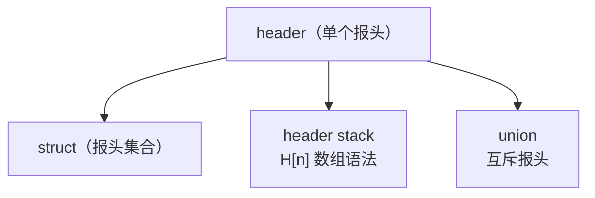
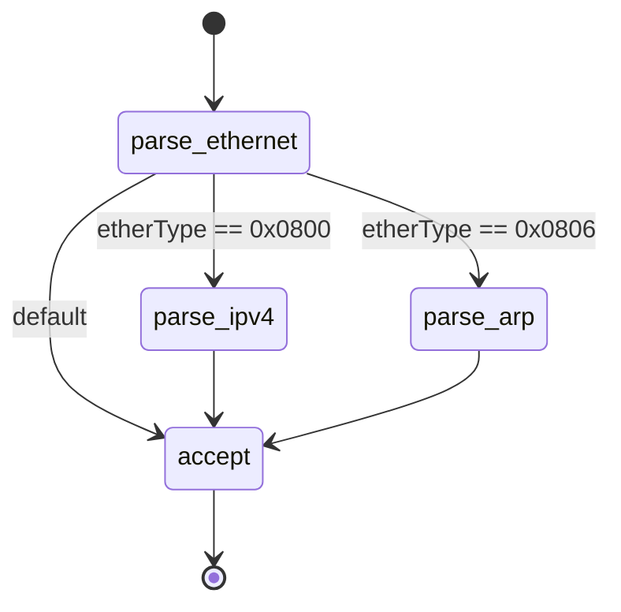
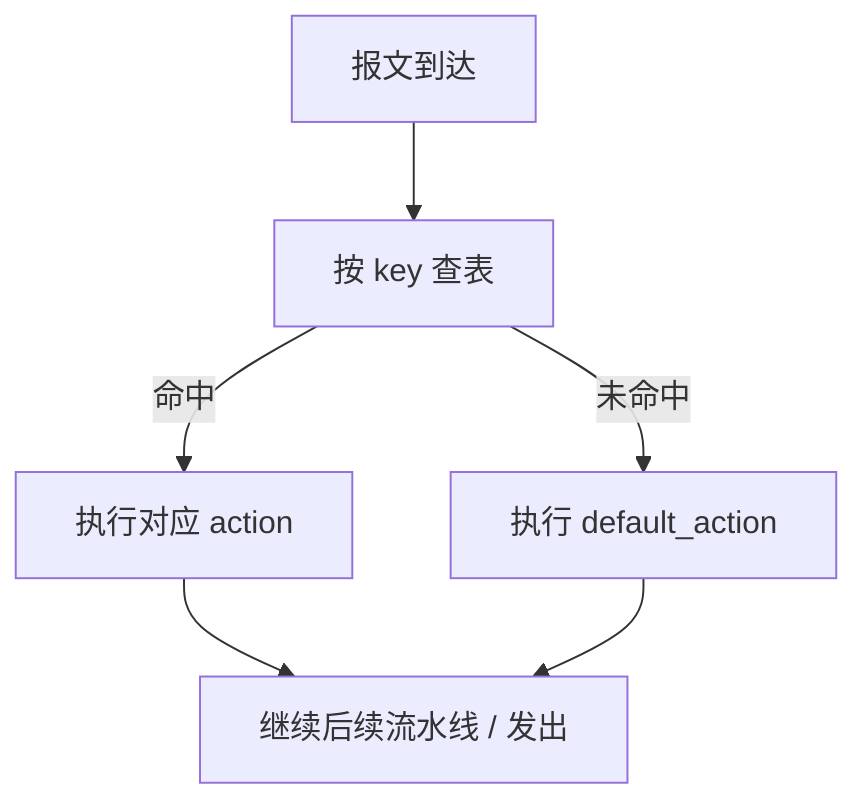
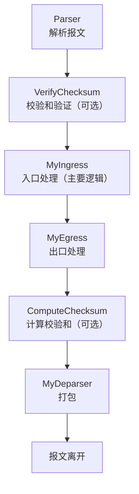

import { Aside } from 'astro-pure/user'

上一篇建立了宏观认知。这一篇直接看代码：目标是让你**读懂并跑通一个最小的 P4 程序**，并且知道每个关键字在干什么。本文不重复规范原文，需要查细节的地方直接给出规范章节号，建议配合 [P4-16 规范 v1.2.5](https://p4.org/p4-specs/) 阅读 [1]。

---

## 一、最小可运行的 P4 程序

这是一个完整的以太网二层转发程序，可以直接用 `p4c` 编译（环境搭建见第三篇）：

```p4
#include <core.p4>
#include <v1model.p4>

/* 1. 报头定义：以太网头 */
header ethernet_t {
    bit<48> dstAddr;
    bit<48> srcAddr;
    bit<16> etherType;
}

/* 2. IPv4 头（简化版） */
header ipv4_t {
    bit<4>  version;
    bit<4>  ihl;
    bit<8>  diffserv;
    bit<16> totalLen;
    bit<16> identification;
    bit<3>  flags;
    bit<13> fragOffset;
    bit<8>  ttl;
    bit<8>  protocol;
    bit<16> hdrChecksum;
    bit<32> srcAddr;
    bit<32> dstAddr;
}

/* 3. 所有报头的集合 + 用户自定义元数据 */
struct headers {
    ethernet_t ethernet;
    ipv4_t     ipv4;
}
struct metadata { }

/* 4. Parser：把字节流解析成报头 */
parser MyParser(packet_in pkt, out headers hdr,
                inout metadata meta, inout standard_metadata_t standard_metadata) {
    state start {
        transition parse_ethernet;
    }
    state parse_ethernet {
        pkt.extract(hdr.ethernet);
        transition select(hdr.ethernet.etherType) {
            0x0800: parse_ipv4;
            default: accept;
        }
    }
    state parse_ipv4 {
        pkt.extract(hdr.ipv4);
        transition accept;
    }
}

/* 5. 入口处理：查表转发 */
control MyIngress(inout headers hdr, inout metadata meta,
                  inout standard_metadata_t standard_metadata) {
    action drop() {
        mark_to_drop(standard_metadata);
    }
    action forward(bit<9> egress_port) {
        standard_metadata.egress_spec = egress_port;
    }
    table l2_forward {
        key = { hdr.ethernet.dstAddr: exact; }
        actions = { forward; drop; }
        default_action = drop();
        size = 1024;
    }
    apply {
        l2_forward.apply();
    }
}

/* 6. 出口处理 / 校验和（这里留空） */
control MyEgress(inout headers hdr, inout metadata meta,
                 inout standard_metadata_t standard_metadata) {
    apply { }
}
control VerifyChecksum(inout headers hdr, inout metadata meta) {
    apply { }
}
control ComputeChecksum(inout headers hdr, inout metadata meta) {
    apply { }
}

/* 7. Deparser：把报头重新打包 */
control MyDeparser(packet_out pkt, in headers hdr) {
    apply {
        pkt.emit(hdr.ethernet);
        pkt.emit(hdr.ipv4);
    }
}

/* 8. 主函数：按 V1Model 顺序组装 */
V1Switch(MyParser(), VerifyChecksum(), MyIngress(),
         MyEgress(), ComputeChecksum(), MyDeparser()) main;
```

这段程序做的事：收到报文 → 解析以太网头（如果是 IPv4 继续解析）→ 查 `l2_forward` 表决定从哪个端口转发或丢弃 → 重新打包发出。下面逐个拆解。

---

## 二、四大构件逐个讲

### 2.1 Header：报文的"身份证"

`header` 用来描述一个协议头的布局，字段类型就是位宽固定的整数 `bit<W>`（W 是位数）：

```p4
header ethernet_t {
    bit<48> dstAddr;   // 48 位 MAC 地址
    bit<48> srcAddr;
    bit<16> etherType; // 0x0800 表示 IPv4
}
```

几个相关概念（规范 §7）：

- **struct**：把多个 header 组合成一个集合（就是程序里的 `headers`）；
- **header stack**：重复出现的报头，如 VLAN 标签栈。P4-16 用数组语法 `vlan_tag[2] vlan;` 声明——**注意不是 P4-14 时代的 `header_stack<...>` 写法**（规范 §7.2.3）[1]；
- **union**：互斥报头（IPv4 / IPv6 二选一）用 `union L3_h { ipv4_t v4; ipv6_t v6; }`；
- **isValid()**：只有被 `extract` 过的 header 才有效，处理前先检查。



### 2.2 Parser：报文解析的状态机

Parser 是一个**有限状态机（FSM）**（规范 §13 定义了 parser 模型 [1]）：每个状态做两件事——`extract` 提取字节到报头，`select` 根据字段值决定跳到哪个状态。



核心原语：

```p4
pkt.extract(hdr.ethernet);                    // 提取以太网头
transition select(hdr.ethernet.etherType) {   // 按 etherType 跳转
    0x0800: parse_ipv4;
    default: accept;
}
verify(hdr.ipv4.version == 4, error.Ipv4IncorrectVersion);  // 条件校验，失败进 reject
bit<16> t = lookahead(bit<16>);               // 偷看但不消费字节
```

### 2.3 Match-Action：转发的灵魂

`table` 定义一张匹配-动作表：用 `key` 声明匹配字段和匹配类型，命中后执行对应 `action`（规范 §13 [1]）。

| 匹配类型 | 语义 | 典型用途 |
|----------|------|----------|
| `exact` | 全比特精确匹配 | MAC 表、VLAN 表 |
| `lpm` | 最长前缀匹配 | IP 路由表 |
| `ternary` | 值 + 掩码（可通配） | ACL、灵活流分类 |



计数器、限速器、寄存器是数据平面做状态的关键（规范 §13、v1model 的 extern [1]）。**v1model 里它们的绑定方式不同，容易写错**：

```p4
// direct_counter：绑定到表，命中表项自动计数
direct_counter(CounterType.PACKETS_AND_BYTES) port_counter;
table l2_forward {
    key = { hdr.ethernet.dstAddr: exact; }
    actions = { forward; drop; }
    counters = port_counter;
}

// 普通 counter：不能在表属性里绑定，要在 action 里显式 count(index)
counter<bit<64>, bit<32>>(1024, CounterType.PACKETS_AND_BYTES) flow_counter;
action count_packet() {
    flow_counter.count((bit<32>)standard_metadata.ingress_port);
}

// register：数据平面"内存"，按索引读写
register<bit<32>>(1024) per_port_pps;
```

### 2.4 Control 与 Deparser

`control` 是处理逻辑的容器，入口是 `apply`：里面按顺序调表、做条件判断、改报头字段。Deparser 负责把处理后的报头用 `emit` 按顺序打回字节流——没被 `emit` 的报头会从报文里消失。

<Aside type='note' title='容易踩坑'>

**P4-16 的控制块里没有通用的 `for` 循环**——语言设计上要求每个报文的处理时间有界，所以循环只存在于 Parser 的状态机里。处理 header stack 需要展开写（或借助 Parser 循环）[1]。

</Aside>

```p4
apply {
    if (hdr.vlan[0].isValid()) {
        hdr.vlan[0].vid = hdr.vlan[0].vid + 1;
    }
    if (hdr.vlan[1].isValid()) {
        hdr.vlan[1].vid = hdr.vlan[1].vid + 1;
    }
}
```

---

## 三、V1Model：六个块怎么串起来

程序里的 `V1Switch(...)` 是 BMv2 的参考架构 **V1Model**：它规定了 Parser、校验和、Ingress、Egress、计算校验和、Deparser 六个块的固定执行顺序（规范 §12 架构概念 [1]）。**注意这只是 BMv2 的架构**——PSA、TNA 等其他架构的流水线结构并不相同。



| 块 | 作用 |
|----|------|
| `Parser` | 把字节流解析成结构化报头 |
| `VerifyChecksum` | 验证校验和（可选，可留空） |
| `MyIngress` | 入口处理：查表、修改报头、决定出端口 |
| `MyEgress` | 出口处理：通常做限速、复制等 |
| `ComputeChecksum` | 计算校验和（可选，可留空） |
| `MyDeparser` | 把报头重新打包成字节流 |

---

## 四、跑起来：编译与验证

把上面的代码存成 `l2_forward.p4`，在装好 P4 工具链的环境里（第三篇讲环境）：

```bash
# 编译成 BMv2 可加载的 JSON
p4c --target bmv2 --arch v1model l2_forward.p4 -o build

# 启动软件交换机（两个端口映射到虚拟网卡）
sudo simple_switch --log-console -i 0@veth0 -i 1@veth1 build/l2_forward.json

# 另一个终端：下发一条 MAC 转发表项
simple_switch_CLI
table_add MyIngress.l2_forward forward 00:00:00:00:00:02 => 1
```

验证方法：从端口 0 发给目的 MAC `00:00:00:00:00:02` 的报文，应当从端口 1 出来；未匹配的报文被默认动作丢弃。具体抓包验证和 Mininet 拓扑见第三篇。

---

## 五、常见坑一览

| 坑 | 正确做法 | 依据 |
|----|----------|------|
| header stack 用 `header_stack<2, H>` | P4-16 用 `H[2]` | 规范 §7.2.3 [1] |
| 控制块里写 `for` 循环 | 展开写，或用 Parser 状态机 | 规范 §11 语句 [1] |
| `counters = c` 挂普通 counter | 只能挂 `direct_counter` | v1model.p4 [2] |
| 以为所有 P4 都是 V1Model | PSA / TNA 结构不同 | 规范 §12 [1] |
| 编译产物叫 `.p4i` | 是 `.p4info.txt`（P4Info） | p4c 文档 [3] |

---

## 参考文献与进阶指引

1. P4 Language Consortium. *P4-16 Language Specification v1.2.5*（Parser §13、类型 §7、语句 §11、架构 §12）. https://p4.org/p4-specs/
2. p4lang. *v1model.p4*（v1model 的 extern 定义）. https://github.com/p4lang/p4c/blob/main/p4include/v1model.p4
3. p4lang. *p4c（P4 编译器）*. https://github.com/p4lang/p4c
4. p4lang. *P4 Tutorials（官方练习：basic、p4runtime 等）*. https://github.com/p4lang/tutorials
5. 张恒华. *P4 中文教程*（作为中文查阅资料）. https://github.com/zhh2001/p4-language-guide-zh

> 阅读提示：本文示例基于官方教程的 `basic` 练习结构整理，完整练习和答案在 p4lang/tutorials 仓库 [4]，建议直接跑官方练习而不是抄教程。

---

*本文是「P4 快速入门」系列的第 2 篇。*

*系列导航：上一篇 → [可编程数据平面，从黑盒到白盒](/blog/p4/p4-01-quickstart-overview) | 下一篇 → [环境、控制平面与研究前沿](/blog/p4/p4-03-practice-frontier)*
