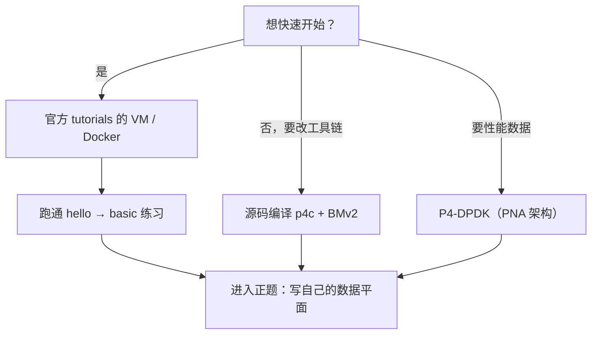
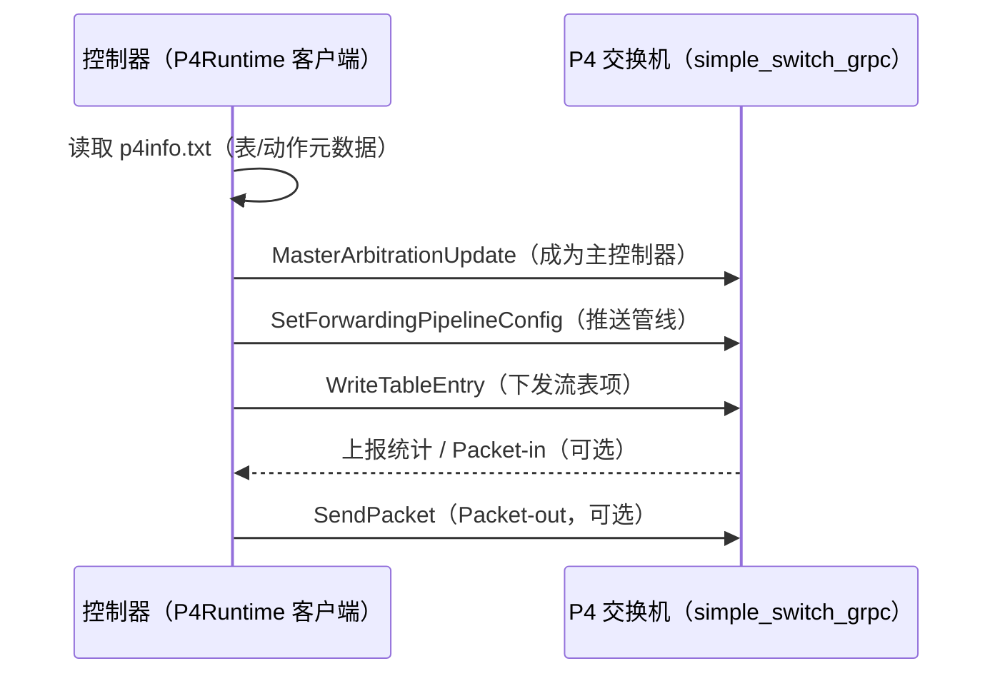
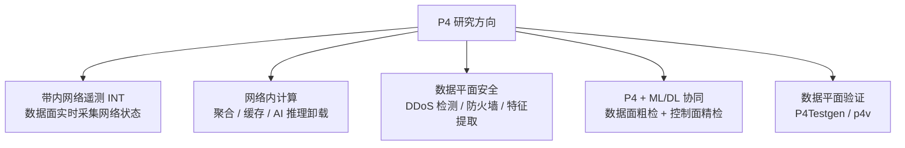

import { Aside } from 'astro-pure/user'

前两篇把 P4 是什么、程序怎么写讲完了。这一篇解决"怎么跑起来"和"学完干什么"：环境搭建、编译运行、用 P4Runtime 做真实控制平面，最后聊聊 2025–2026 年 P4 方向的热点，给想找选题的人一张地图。

---

## 一、环境：三条路怎么选

| 方案 | 优点 | 缺点 | 适合 |
|------|------|------|------|
| 官方教程 VM / Docker | 一键就绪，版本匹配 | 镜像较大 | 大多数人（推荐） |
| 本机编译安装（p4c + BMv2） | 灵活、可调试源码 | 编译 30–60 分钟，依赖多 | 要改工具链的人 |
| P4-DPDK（PNA） | 普通服务器接近线速 | 生态较新，资料少 | 性能相关实验 |

**Windows 用户建议直接用 WSL2 + Docker**（或官方教程提供的 Ubuntu VM），避开本机编译的依赖地狱 [1][2]。



---

## 二、工具链：p4c → BMv2 → Mininet

一次完整的"写代码 → 跑起来"流程是这样的：


核心命令（承接第二篇的示例）：

```bash
# 编译
p4c --target bmv2 --arch v1model l2_forward.p4 -o build

# 启动带 gRPC 的软件交换机（P4Runtime 需要）
sudo simple_switch_grpc --no-p4 -- --device-id 0 \
  --grpc-server-addr 0.0.0.0:50051 \
  -i 0@veth0 -i 1@veth1 build/l2_forward.json

# Mininet 拓扑与抓包验证见官方练习的 run.sh
```

更完整的实验流程（含官方练习的目录结构、`run.sh`、`commands.txt`）直接看 p4lang/tutorials 仓库的 README [2]，这里不重复。

---

## 三、控制平面：P4Runtime

### 3.1 为什么需要它

上一篇文章里我们用 `simple_switch_CLI` 手工下表项，这在实验里够用，但真实场景中表项是**控制器根据网络状态动态下发**的。P4Runtime 就是标准化的"控制平面 ↔ 数据平面"通信协议，基于 gRPC，核心能力包括 [3]：

1. 下发/读取匹配-动作表项（Write / Read）
2. 推送管线配置（把编译产物部署到交换机）
3. 收发报文（Packet-in / Packet-out）
4. 读取计数器、寄存器等状态

### 3.2 工作流程



### 3.3 真实 Python 代码

下面的代码基于 p4lang/tutorials 的 `p4runtime_lib` 编写（这是官方练习自带的客户端库）[2]：

```python
from p4runtime_lib.helper import P4InfoHelper
import p4runtime_lib.bmv2

# 1. 读取编译产物中的 P4Info（表/动作的元数据）
p4info_helper = P4InfoHelper('build/l2_forward.p4info.txt')

# 2. 连接交换机（simple_switch_grpc 监听 50051）
sw = p4runtime_lib.bmv2.Bmv2SwitchConnection(
    name='s1', address='127.0.0.1:50051',
    device_id=0, proto_dump_file='p4runtime.txt')

# 3. 成为主控制器 + 推送管线配置
sw.MasterArbitrationUpdate()
sw.SetForwardingPipelineConfig(
    p4info=p4info_helper.p4info,
    bmv2_json_path='build/l2_forward.json')

# 4. 下发一条表项：目的 MAC -> 端口 1
te = p4info_helper.build_table_entry(
    table_name='MyIngress.l2_forward',
    match_fields={'hdr.ethernet.dstAddr': '00:00:00:00:00:02'},
    action_name='MyIngress.forward',
    action_params={'egress_port': 1})
sw.WriteTableEntry(te)
```

想深入 Packet-in/Packet-out 和 L2 学习交换机，官方练习里有完整的 `l2_switch` 实现 [2]；协议细节看 [P4Runtime 规范](https://p4.org/p4-specs/p4runtime/) [3]。

---

## 四、架构对比：v1model / PSA / TNA

很多人学完 V1Model 就以为 P4 只有这一种架构，其实不是：

| 架构 | 全称 | 目标平台 | 特点 |
|------|------|----------|------|
| **V1Model** | — | BMv2（软件） | 学习友好，六块固定流水线 |
| **PSA** | Portable Switch Architecture | 多厂商可移植交换机 | 标准化程度更高，面向生产 |
| **TNA** | Tofino Native Architecture | Intel Tofino ASIC | 硬件专用，性能上限高 |

选择建议：**学习用 V1Model，研究性能用 P4-DPDK/PNA，发论文要硬件结果才碰 TNA**（Tofino 设备很贵，组里没有的话别硬来）。

---

## 五、研究前沿（2025–2026）

下面这张图是当前 P4 方向最活跃的几个领域，每个都可以作为选题入口：



几个值得读的入口：

- **数据平面安全综述**：*Programmable Data Planes for Network Security*（arXiv 2025）系统梳理了可编程交换机上的安全工作，包括 heavy-hitter 检测、DDoS 缓解等 [4]。
- **P4 入侵检测综述**：*Leveraging programmable data plane for network intrusion detection: A survey*（Computer Networks, 2026）是第一篇专门讲"用可编程数据平面做入侵检测"的综述 [5]。
- **P4 全景综述**：*Advancing SDN from OpenFlow to P4: A Survey*（ACM Computing Surveys, 2023），它的第 3 节是应用分类、第 6 节是未来方向 [6]。
- **热门结合点**：P4 数据平面做线速特征提取 + 控制平面跑深度学习分类，是当前"P4 + 入侵检测"最活跃的交叉方向 [4][5]，也正好是组里两条研究线的交汇处。

<Aside type='note' title='给新人的选题建议'>

不要一上来就想"发明新架构"。最稳的路是：**复现一篇论文的方法（数据平面 + 控制平面），改一个点（检测算法、特征、联动策略），用自己的实验数据说话**。文献里的"future work"就是现成的选题库。

</Aside>

---

## 六、下一步

1. 跑通官方 tutorials 的 `hello` 和 `basic`（半天）；
2. 把 `basic` 升级成你自己的 L2 学习交换机，配上 P4Runtime Python 控制器（一两天）；
3. 想清楚你要解决的问题，再开始读综述找 gap；
4. 把实验过程和踩坑记下来——这既是博客素材，也是论文的实验章节。

---

## 参考文献

1. p4lang. *P4 Tutorials（官方练习，含 VM/Docker 环境）*. https://github.com/p4lang/tutorials
2. p4lang. *p4runtime_lib（官方 Python 客户端库）*. https://github.com/p4lang/tutorials/tree/master/utils
3. P4 Language Consortium. *P4Runtime Specification*. https://p4.org/p4-specs/p4runtime/
4. *Programmable Data Planes for Network Security*. arXiv:2507.22165, 2025. https://arxiv.org/abs/2507.22165
5. *Leveraging programmable data plane for network intrusion detection: A survey*. Computer Networks, 2026. https://www.sciencedirect.com/science/article/pii/S1389128626002148
6. A. Liatifis et al. *Advancing SDN from OpenFlow to P4: A Survey*. ACM Computing Surveys, 2023. https://doi.org/10.1145/3556973
7. P4 Language Consortium. *P4-16 Language Specification v1.2.5*. https://p4.org/p4-specs/
8. p4lang. *behavioral-model（BMv2）*. https://github.com/p4lang/behavioral-model

---

*本文是「P4 快速入门」系列的第 3 篇。*

*系列导航：上一篇 → [一次看懂 P4 程序](/blog/p4/p4-02-language-core)*
