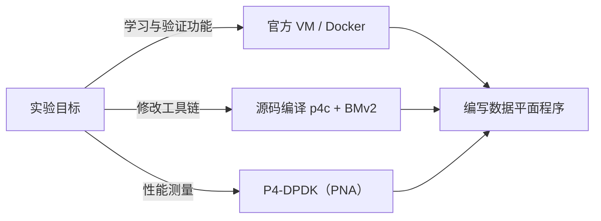
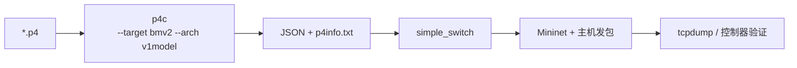
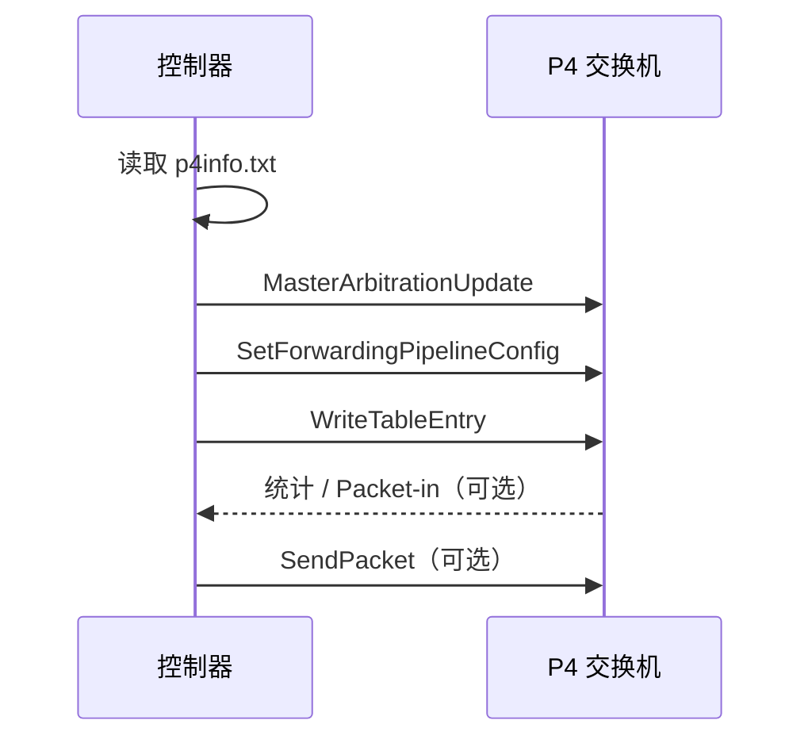
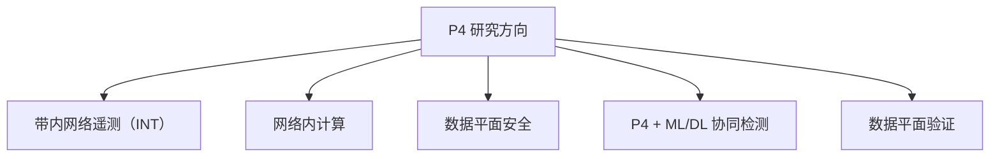

本文介绍 P4 实验环境的搭建方式、P4Runtime 控制平面的使用方法，以及当前活跃的研究方向。

---

## 一、实验环境

常用环境方案对比如下：

| 方案                   | 优点               | 缺点               | 适用场景       |
| ---------------------- | ------------------ | ------------------ | -------------- |
| 官方教程 VM / Docker   | 即开即用，版本匹配 | 镜像较大           | 学习与常规实验 |
| 源码编译（p4c + BMv2） | 可修改工具链       | 编译耗时长，依赖多 | 工具链开发     |
| P4-DPDK（PNA）         | 普通服务器接近线速 | 生态较新           | 性能实验       |

一般建议直接使用官方 tutorials 提供的 VM / Docker 环境 [1]；如需修改编译器或运行时再源码编译。



---

## 二、工具链

完整流程为：p4c 编译源码，生成 JSON 与 p4info；simple_switch 加载运行；Mininet 构建拓扑并验证。



核心命令（承接第二篇示例）：

```bash
p4c --target bmv2 --arch v1model l2_forward.p4 -o build
sudo simple_switch_grpc --no-p4 -- --device-id 0 \
  --grpc-server-addr 0.0.0.0:50051 \
  -i 0@veth0 -i 1@veth1 build/l2_forward.json
```

完整实验流程（目录结构、run.sh、commands.txt）见官方 tutorials [1]。

---

## 三、控制平面：P4Runtime

静态实验中可通过 `simple_switch_CLI` 手动下发流表；动态场景下，表项由控制器根据网络状态下发。P4Runtime 是基于 gRPC 的控制平面-数据平面通信协议 [3]，提供：

1. 表项读写（Write / Read）；
2. 管线配置推送；
3. 报文收发（Packet-in / Packet-out）；
4. 计数器与寄存器状态读取。



以下代码基于官方 `p4runtime_lib` [2]：

```python
from p4runtime_lib.helper import P4InfoHelper
import p4runtime_lib.bmv2

p4info_helper = P4InfoHelper('build/l2_forward.p4info.txt')

sw = p4runtime_lib.bmv2.Bmv2SwitchConnection(
    name='s1', address='127.0.0.1:50051',
    device_id=0, proto_dump_file='p4runtime.txt')

sw.MasterArbitrationUpdate()
sw.SetForwardingPipelineConfig(
    p4info=p4info_helper.p4info,
    bmv2_json_path='build/l2_forward.json')

te = p4info_helper.build_table_entry(
    table_name='MyIngress.l2_forward',
    match_fields={'hdr.ethernet.dstAddr': '00:00:00:00:00:02'},
    action_name='MyIngress.forward',
    action_params={'egress_port': 1})
sw.WriteTableEntry(te)
```

Packet-in / Packet-out 与 L2 学习交换机的完整实现见官方练习 [1]；协议规范见 [P4Runtime Specification](https://p4.org/p4-specs/p4runtime/) [3]。

---

## 四、架构对比

| 架构    | 全称                         | 目标平台     | 特点                 |
| ------- | ---------------------------- | ------------ | -------------------- |
| V1Model | —                            | BMv2         | 学习友好，六块流水线 |
| PSA     | Portable Switch Architecture | 多厂商交换机 | 面向生产，可移植性高 |
| TNA     | Tofino Native Architecture   | Intel Tofino | 硬件专用，性能上限高 |

学习阶段使用 V1Model；性能实验可考虑 P4-DPDK；TNA 需要 Tofino 硬件，成本较高。

---

## 五、研究前沿

当前 P4 方向活跃的研究领域：



推荐入口：

- _Programmable Data Planes for Network Security_（arXiv 2025）：可编程交换机安全应用的系统综述，涵盖 heavy-hitter 检测与 DDoS 缓解 [4]；
- _Leveraging programmable data plane for network intrusion detection: A survey_（Computer Networks, 2026）：面向入侵检测的可编程数据平面综述 [5]；
- _Advancing SDN from OpenFlow to P4: A Survey_（ACM Computing Surveys, 2023）：第 3 节为应用分类，第 6 节为未来方向 [6]。

P4 数据平面特征提取与深度学习检测的协同架构是当前活跃的交叉方向 [4][5]。

---

## 六、下一步

1. 完成官方 tutorials 的 hello 与 basic 练习；
2. 实现 L2 学习交换机并配合 P4Runtime 控制器；
3. 明确研究问题后阅读综述确定 gap；
4. 记录实验过程，作为博客与论文素材。

---

## 参考文献

1. p4lang. _P4 Tutorials_. https://github.com/p4lang/tutorials
2. p4lang. _p4runtime_lib_. https://github.com/p4lang/tutorials/tree/master/utils
3. P4 Language Consortium. _P4Runtime Specification_. https://p4.org/p4-specs/p4runtime/
4. _Programmable Data Planes for Network Security_. arXiv:2507.22165, 2025. https://arxiv.org/abs/2507.22165
5. _Leveraging programmable data plane for network intrusion detection: A survey_. Computer Networks, 2026. https://www.sciencedirect.com/science/article/pii/S1389128626002148
6. A. Liatifis et al. _Advancing SDN from OpenFlow to P4: A Survey_. ACM Computing Surveys, 2023. https://doi.org/10.1145/3556973
7. P4 Language Consortium. _P4-16 Language Specification v1.2.5_. https://p4.org/p4-specs/
8. p4lang. _behavioral-model（BMv2）_. https://github.com/p4lang/behavioral-model

---

_本文是「P4 快速入门」系列的第 3 篇。_

_系列导航：上一篇 → [一次看懂 P4 程序](/blog/p4/p4-02-language-core)_
