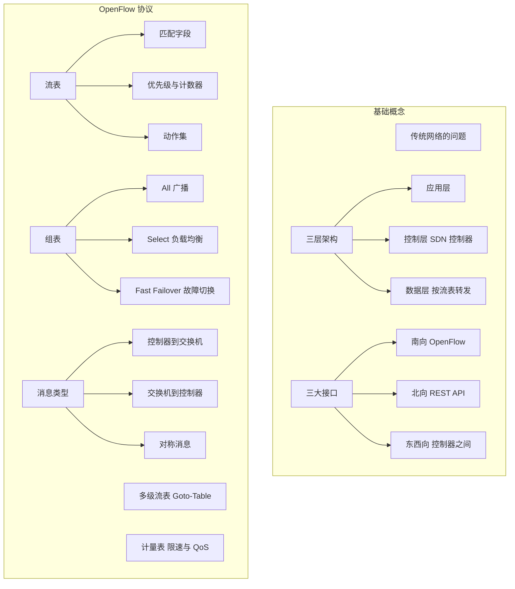
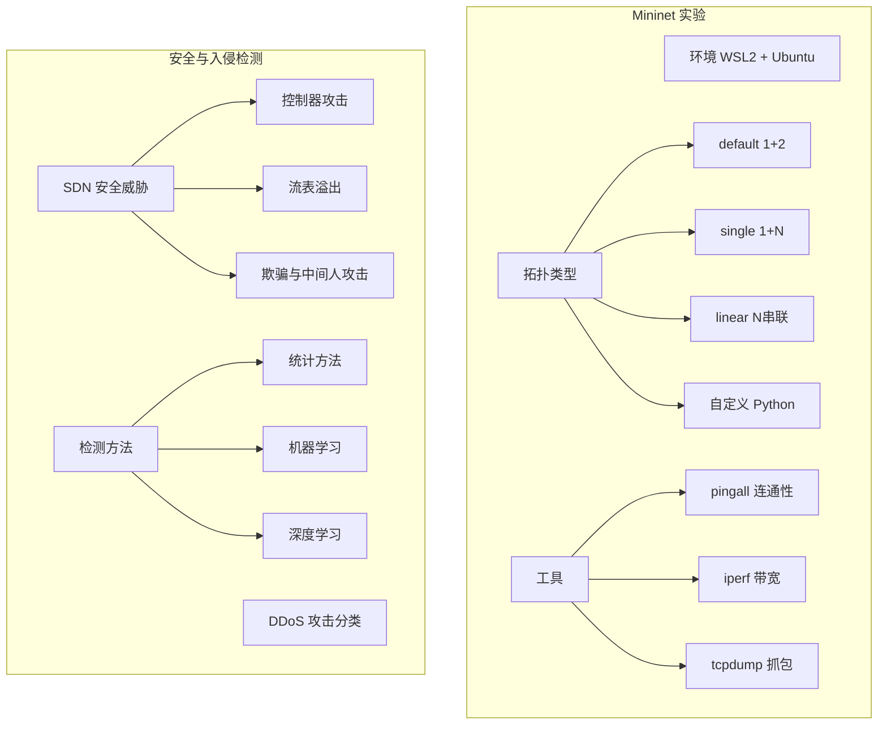
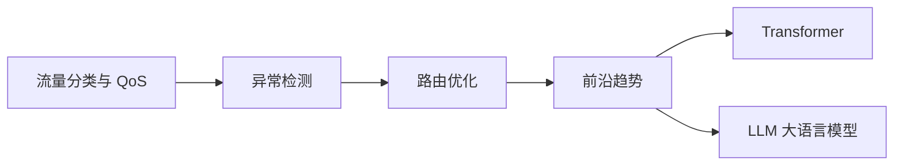
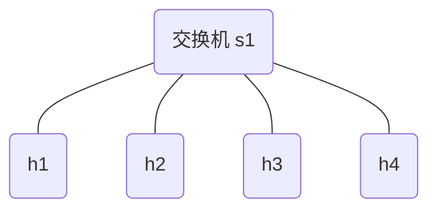
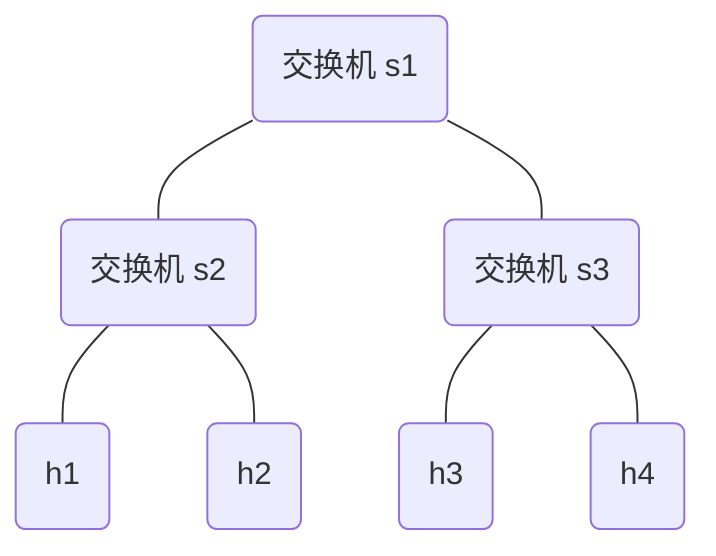

把前面学到的知识串成一个完整的知识体系。这一周从 SDN 概念到 Mininet 实验，再到入侵检测和 ML 应用，建立了比较完整的入门认知。

---

## 一、知识回顾

### SDN 是什么

- 传统网络的困境：控制与转发紧耦合，各自为政
- SDN 核心思想：把控制权集中，设备只负责转发
- 三层架构：应用层 / 控制层 / 数据层
- 三大接口：南向（OpenFlow）、北向（REST API（Application Programming Interface，应用程序编程接口））、东西向（控制器间通信）

### SDN 架构深入

- 控制层与数据层解耦的机制
- 控制器的职责：全网视图、路径计算、流表下发
- 常见控制器：Ryu、Floodlight、ONOS、OpenDaylight
- 三大接口的详细职责与协作

### OpenFlow 协议详解

- 流表结构：匹配字段、优先级、计数器、动作集
- 多级流表：流水线式匹配（Goto-Table）
- 组表：All/Select/Indirect/Fast Failover 四种类型
- 计量表：限速、标记、QoS（Quality of Service，服务质量）
- 控制器与交换机的消息交互

### Mininet 实验

- WSL2 + Ubuntu 24.04 环境搭建
- Mininet 安装（含 pep8 兼容性修复）
- 基础拓扑实验：default / single-3 / linear-4
- 自定义 Python 拓扑（2 交换机 + 4 主机）
- tcpdump 抓包观察流量

### 网络入侵检测入门

- SDN 面临的安全威胁
- DDoS（Distributed Denial of Service，分布式拒绝服务）攻击分类（按目标、按特征）
- 三大检测方法：统计 / 机器学习 / 深度学习
- SDN + 入侵检测的结合方式

### ML/AI + SDN 前沿

- ML（Machine Learning，机器学习）在 SDN 的三大应用：流量分类、异常检测、路由优化
- 传统方法 vs ML vs DL（Deep Learning，深度学习）全面对比
- Transformer 与 LLM（Large Language Model，大语言模型）在网络安全中的探索

---

## 二、思维导图

把 SDN 入门知识整理成知识图谱，分为五个模块：

### 1. 基础概念与 OpenFlow 协议



### 2. Mininet 实验与安全检测



### 3. ML + SDN 前沿



---

## 三、Mininet 实验巩固

再跑几个实验巩固手感：

### 3.1 星型拓扑

```bash
sudo mn --topo single,4 --test pingall
```

拓扑图：



4 台主机都连在同 1 台交换机上，任何两台之间只需经过 1 跳。结果：

```
*** Results: 0% dropped (12/12 received)
```

### 3.2 树形拓扑

```bash
sudo mn --topo tree,depth=2,fanout=2 --test pingall
```

深度 2、分支因子 2 的树形拓扑，共 4 台主机 + 3 台交换机。拓扑结构：



### 3.3 iperf 带宽对比

```bash
sudo mn --topo single,2
mininet> iperf
```

单跳（经过 1 台交换机）的 TCP 带宽通常在 90+ Gbits/sec（内存转发），多跳会略有下降但差异不大——因为 Mininet 的虚拟链路本质上走的是内核内存。

---

## 四、遗留问题清单

学习中可能还不太清楚的问题：

| 问题 | 优先级 | 计划解决时间 |
|------|--------|------------|
| Ryu 控制器如何编写简单的 L2 Switch | 高 | 后续 |
| 如何在 Mininet 中运行 Ryu 控制器 | 高 | 后续 |
| P4 环境搭建与第一个 P4 程序 | 高 | 下一篇 |
| 深度学习模型如何部署到实际网络中 | 低 | 后续研究 |

---

## 五、本章小结

| 项目 | 内容 |
|------|------|
| 复习 | 回顾全部内容 |
| 整理 | 完成 SDN 入门知识体系思维导图 |
| 实验 | 星型拓扑、树形拓扑 pingall，iperf 带宽对比 |
| 规划 | 列出遗留问题，为 P4 学习做准备 |
| 下一篇预告 | P4 系列：从 OpenFlow 到 P4 可编程数据面（独立系列） |

---

*本文是「SDN 学习指南」系列的第7篇（完结）。*

*系列导航：上一篇 → ML 与 SDN*
